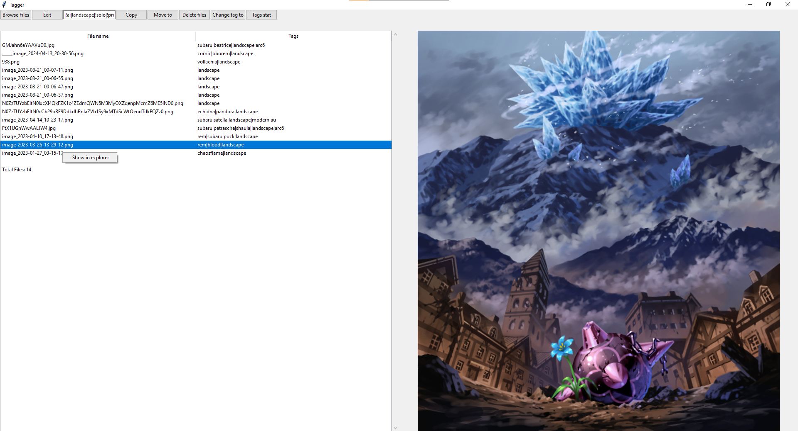

# File Tagger
Allows to mark files with your own tags and then search by tags or filename. 
Previews are available for images and videos. 
### Tagging
To tag files select them or their tags on the list and press Enter. Tags are added one at a time. Press Enter to submit a tag, Tab to use the first suggested, KeyDown to scroll the suggestions list. Escape to finish tagging. 
Clear all tags of selected files with Backspace. 
##### Renaming tags
You can change all instances of an existing tag to a new tag name.
##### Tag stats
You can see the tags statistics in a list form sorted in descending order by the usage count.
### Searching
Search comes in 3 modes.  
1) Default search is by filename.  
2) Separate tags with "|", if there are any "|" symbols in the query, search will be done by tags. Putting ! before the tag will remove the files containing it. Separating tags with ~ will choose files containing at least one of them.  
|A|B~C will select files with A|B, A|C, A|B|C; 
|A|!B|C will select files with A|C. 
3) Including "||" in the beginning will search for files with ONLY specified tags and nothing else. Negative tag and ~ tag are not supported in this mode. 

After typing a query press Enter to apply it.
### Copying/Moving
You can copy images to clipboard on Ctrl+C. For gifs only the first frame is copied.  
To copy/move a batch of files select them and press "Copy"/"Move to" accordingly. The following will copy/move the files to a selected folder and create a copy of all related tags for the destination folder.
### Deletion
You can delete selected files with the respective button.
### Extra
On a right click you can show the currently selected file in an explorer window.
### UI Demonstration
